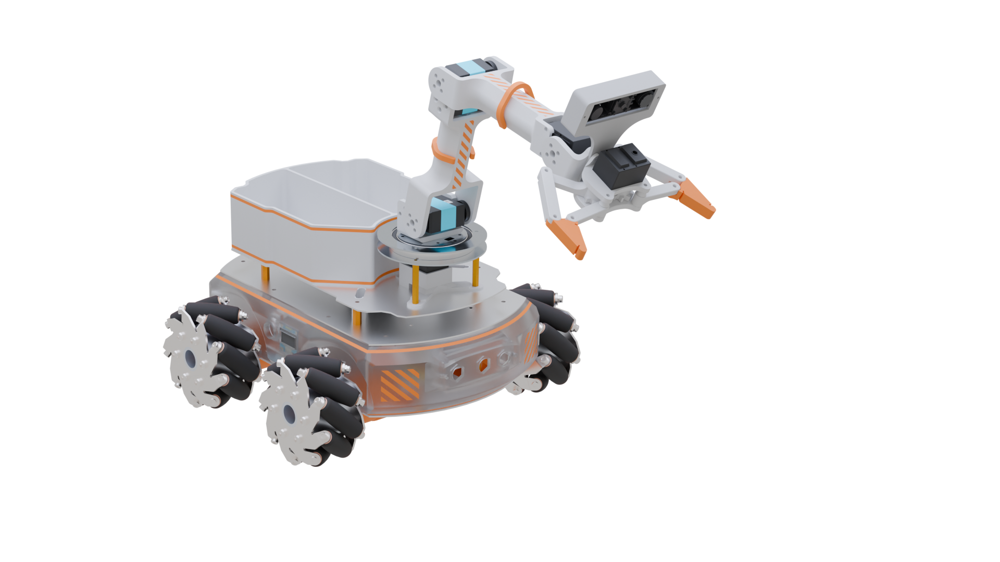
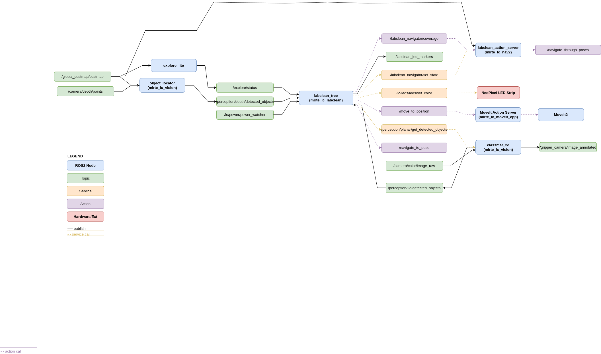

Mirte Lab Cleaner Documentation
================================

.. toctree::
   :maxdepth: 1
   :caption: Packages

.. image:: https://img.shields.io/badge/status-in%20progress-yellow
   :alt: Status: In Progress

The Mirte Master Lab Cleanup Robot is an autonomous mobile manipulator designed
to identify, retrieve, and sort objects in a laboratory environment without human
intervention. The system combines frontier-based exploration, coverage path
planning, 3D object detection, and colour-based classification to fully automate
the lab cleaning task.

The robot platform is the **Mirte Master**, a mechanum-drive mobile robot
with a 4-DOF arm and 5-bar-linkage gripper. It uses an  gripper-mounted Orbbec Astra depth camera for
3D perception and 2D classification. Navigation is handled by the ROS 2 **Nav2** stack, motion
planning by **MoveIt 2**, and task coordination by a **py_trees** behaviour tree.

----

Package Documentation
---------------------

This is the top-level documentation for the **mirte_lc** ROS 2 project.
Each ROS 2 package has its own API documentation:

.. list-table::
   :widths: 30 70
   :header-rows: 1

   * - Package
     - Description
   * - `mirte_lc_gazebo </Mirte_Lab_Clean/documentation/docs_output/mirte_lc_gazebo/index.html>`_
     - Gazebo simulation worlds and launch files
   * - `mirte_lc_labclean </Mirte_Lab_Clean/documentation/docs_output/mirte_lc_labclean/index.html>`_
     - Main behaviour tree and lab cleaning logic
   * - `mirte_lc_moveit_cpp </Mirte_Lab_Clean/documentation/docs_output/mirte_lc_moveit_cpp/index.html>`_
     - MoveIt C++ action server for arm control
   * - `mirte_lc_msgs </Mirte_Lab_Clean/documentation/docs_output/mirte_lc_msgs/index.html>`_
     - Custom ROS 2 message, service, and action definitions
   * - `mirte_lc_nav2 </Mirte_Lab_Clean/documentation/docs_output/mirte_lc_nav2/index.html>`_
     - Nav2 coverage navigation and frontier-based exploration
   * - `mirte_lc_vision </Mirte_Lab_Clean/documentation/docs_output/mirte_lc_vision/index.html>`_
     - Object detection and 3D localisation via YOLO + point cloud

----
ROS 2 Node Architecture
-----------------------

The system is composed of eleven ROS 2 nodes that communicate through topics,
services, and actions. The nodes are organised into four functional layers:
navigation, manipulation, perception, and task coordination.

Key interfaces between nodes:

.. list-table::
   :widths: 25 20 15 40
   :header-rows: 1

   * - Interface
     - Type
     - Kind
     - Between
   * - ``/perception/depth/detected_objects``
     - ``mirte_lc_msgs/DetectedObjectArray``
     - Topic
     - ``object_locator`` → ``labclean_tree``
   * - ``/labclean_navigator/coverage``
     - ``mirte_lc_msgs/NavigateCoverage``
     - Action
     - ``labclean_tree`` → ``labclean_action_server``
   * - ``/labclean_navigator/set_state``
     - ``mirte_lc_msgs/ServeCoverageStatus``
     - Service
     - ``labclean_tree`` → ``labclean_action_server``
   * - ``/move_to_position``
     - ``mirte_lc_msgs/MoveToPosition``
     - Action
     - ``labclean_tree`` → ``mirte_lc_moveit_action_server``
   * - ``/navigate_to_pose``
     - ``nav2_msgs/NavigateToPose``
     - Action
     - ``labclean_tree``, ``labclean_action_server`` → Nav2
   * - ``/navigate_through_poses``
     - ``nav2_msgs/NavigateThroughPoses``
     - Action
     - ``labclean_action_server`` → Nav2
   * - ``/perception/planar/get_detected_objects``
     - ``mirte_lc_msgs/GetDetectedObjects``
     - Service
     - ``labclean_tree`` → ``yolo_detector``
   * - ``/global_costmap/costmap``
     - ``nav_msgs/OccupancyGrid``
     - Topic
     - Nav2 → ``object_locator``, ``labclean_action_server``
   * - ``/io/power/power_watcher``
     - battery msg
     - Topic
     - Hardware → ``labclean_tree``
   * - ``/explore/status``
     - ``explore_lite_msgs/ExploreStatus``
     - Topic
     - ``explore_server`` → ``labclean_tree``

----

Quickstart
----------

Clone and build the full workspace:

.. code-block:: bash

   cd ~/ros2_ws/src
   git clone https://github.com/matt-rbt/Mirte_Lab_Clean
   cd ~/ros2_ws
   vcs import src/ < src/mirte_lc/sources.repos
   cd src/mirte-ros-packages && git submodule update --init --recursive && cd ../..
   rosdep install -y --from-paths src/ --ignore-src --rosdistro humble
   colcon build --symlink-install

Launch the full stack on the real robot:

.. code-block:: bash

   ros2 launch mirte_lc_labclean labclean_bringup.launch.py use_sim_time:=false

Launch in simulation:

.. code-block:: bash

   # Terminal 1 — Gazebo
   ros2 launch mirte_lc_gazebo gazebo_mirte_lc.launch.py

   # Terminal 2 — full stack
   ros2 launch mirte_lc_labclean labclean_bringup.launch.py use_sim_time:=true

See :doc:`quickstart` for the full installation guide including robot-only sparse
checkout, clock synchronisation, and visualisation setup.

----
Clock Synchronisation
---------------------

ROS 2 requires the clocks on the robot and the development laptop to be
synchronised to within ~1 ms for TF and sensor fusion to work correctly.
Chrony is used to sync the laptop to the robot:

On the **robot** — add to ``/etc/chrony/chrony.conf``:

.. code-block:: text

   local stratum 8
   allow 192.168.178.0/24
   allow 192.168.42.0/24

On the **laptop** — add to ``/etc/chrony/chrony.conf``:

.. code-block:: text

   server 192.168.42.148 iburst prefer
   server 192.168.178.38 iburst
   makestep 1.0 3

Verify synchronisation:

.. code-block:: bash

   chronyc sources -v
   # 192.168.x.x should show ^* (current best source)

----
